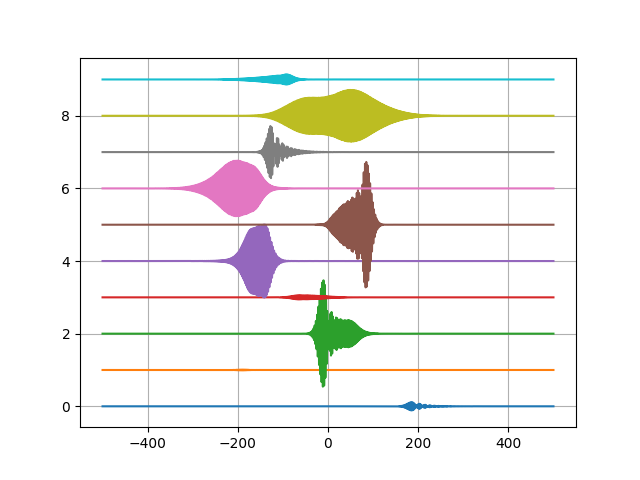

# generate\_dataset
==============================
Generating dataset of broadband pulses of varying spectral phase (and noise floor).  The noise floor is not implemented yet since this can be added at the time of use for random white noise.  This will be implemented after we have a noise model decided and then we will also likely trim out the storage of also chirp, phase, and spectrum of the result.

Edit the config file `set_vars` to set the window of delay and other pulse parameters, as well as the number of threads and pulses generated per thread.


The driver script `./run_10.bash` will launch sequential runs of...  
```bash
#!/bin/bash
source ./set_vars;
for i in 0 2 3 .. 10
do
./generate_dataset;
sleep 30;
done
```
The `sleep 30` is used to ensure the second h5 file will pick up the next minute for the name.  This is an artifact we can change later once we know how many `npulses` we can set in the config file `set_vars`.  The `npulses` of only 4096 for my laptop with `nthreads = 8` is limited to use about 55% of the system memory (32GB total) since memory usage scales linearly with (`nthreads * npuses`).  One can adjust the sleep time and npulses and nthreads based on the target system.  Be careful, I easily and accidentally filled my laptop filesystem, each file is 3BG and so `./run_10` will fill 30GB of hard disc space.


sample pulses, x-axis is time in femtoseconds (I think).  

## Notes to self  
-------------
It takes significantly longer to write the .h5 files into the flash memory card (pcie bus) than it does to the local `$HOME` filesystem on the laptop.  If going straight ot flash, then there is no need for the sleep 30 in the `run_10.bash` script.  The bulk of the time is spent in file writing 282s versus direc is only 38s, the actual pulse generation in system memory only takes 18 seconds.  This shows the importance of using local persistent storage compared to NAS or peripheral persistent storage.

```bash
---	Environment variables exported
---	filebase = /media/coffee/9C33-6BBD/pulsegendata/h5files/800nm/dataset
---	nthreads = 8
---	npulses = 4096
		======================================
		======= gen pulses started ========
		===== Fri Jun 16 16:29:41 2023
		===== on host coffee-ThinkPad-X395:::::::
		===== using 8 threads
		======================================
filebase in main() is /media/coffee/9C33-6BBD/pulsegendata/h5files/800nm/dataset
initializing pulse and plans
	It has taken 0 s for initializing pulse and fftw plans
waves.size()	32768	waves.front().size()	8000
	loop n = 	loop n = 0 in thread 5
	loop n = 	loop n = 0 in thread 2
	loop n = 0 in thread 4
	loop n = 0 in thread 06
0 in thread 3
 in thread 1
	loop n = 0 in thread 7
	loop n = 0 in thread 0
	loop n = 256 in thread 5
	loop n = 256 in thread 3
	loop n = 256 in thread 1
	loop n = 256 in thread 4
	loop n = 256 in thread 0
	loop n = 256 in thread 7
	loop n = 256 in thread 6
	loop n = 256 in thread 2
	loop n = 512 in thread 5
	loop n = 512 in thread 1
	loop n = 512 in thread 3
	loop n = 512 in thread 0

	loop n = 3840 in thread 3
	loop n = 3840 in thread 1
	loop n = 3840 in thread 2
	loop n = 3840 in thread 7
	loop n = 3840 in thread 0
	loop n = 3840 in thread 4
	loop n = 3840 in thread 5
	loop n = 3840 in thread 6
		############ ending parallel region 1 ###########
		################## thread id 0 ##################
		##############params lambda_0: 800##############
		############## Destroying plans ################
 ---- just left parallel region -----
 ---- and destroyed plan vectors ----
 ---------- runtimes are ------------
17	17	17	17	18	17	18	17	
 ------------------------------------
 ---------- Writing H5 file ---------
 --------- consider parallel --------
outfile = /media/coffee/9C33-6BBD/pulsegendata/h5files/800nm/dataset-2023-6-16-h16-m30.h5
		======================================
		======== generate pulses stopped =======
		===== Fri Jun 16 16:34:23 2023
		===== in 282 s ====
		======================================

```

Compared to writing directly to local drive not on pcie bus.  

```bash
---	Environment variables exported
---	filebase = /home/coffee/pulsegendata/h5files/800nm/dataset
---	nthreads = 8
---	npulses = 4096
		======================================
		======= gen pulses started ========
		===== Fri Jun 16 16:36:43 2023
		===== on host coffee-ThinkPad-X395:::::::
		===== using 8 threads
		======================================
filebase in main() is /home/coffee/pulsegendata/h5files/800nm/dataset
initializing pulse and plans
	It has taken 0 s for initializing pulse and fftw plans
waves.size()	32768	waves.front().size()	8000
	loop n = 0 in thread 6
	loop n = 	loop n = 0 in thread 7
	loop n = 0 in thread 	loop n = 0 in thread 4
	loop n = 0 in thread 2
3
0 in thread 1
	loop n = 0 in thread 5
	loop n = 0 in thread 0
	loop n = 256 in thread 6
	loop n = 256 in thread 7
	loop n = 256 in thread 3
	loop n = 256 in thread 5
	loop n = 256 in thread 2
	loop n = 256 in thread 0
	loop n = 256 in thread 1
	loop n = 256 in thread 4

		############ ending parallel region 1 ###########
		################## thread id 0 ##################
		##############params lambda_0: 800##############
		############## Destroying plans ################
 ---- just left parallel region -----
 ---- and destroyed plan vectors ----
 ---------- runtimes are ------------
17	17	17	17	17	17	16	16	
 ------------------------------------
 ---------- Writing H5 file ---------
 --------- consider parallel --------
outfile = /home/coffee/pulsegendata/h5files/800nm/dataset-2023-6-16-h16-m37.h5
		======================================
		======== generate pulses stopped =======
		===== Fri Jun 16 16:37:21 2023
		===== in 38 s ====
		======================================
```

-------------


Project Organization
--------------------

    .
    ├── AUTHORS.md
    ├── LICENSE
    ├── README.md
    ├── makefile
    ├── config/
    ├── src/
    ├── include/
    ├── bin/
    ├── models/
    ├── notebooks/
    ├── sandbox/
    ├── docs/
    ├── figs/
    ├── references/
    ├── objects/
    └── reports/
